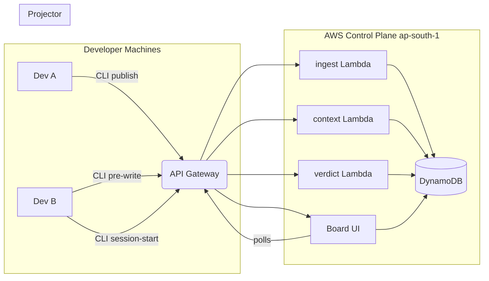

# Merge Lab

The pre-push context layer.

An interface decision - the shape of a User, the name of a route, the choice of HTTP client - is made in the first five minutes of a session, but its implementation takes the next three hours. Merge Lab is a linter for your teammates' unpushed decisions that moves these choices onto the wire the moment they exist, not the moment they ship. A local daemon watches each dev's working tree (including uncommitted changes) and publishes **declarations only** - exported signatures, data shapes, deps, env var names, routes. Never source code. Teammates' agents read those contracts at SessionStart and are blocked at PreToolUse when a write drifts from them.

## Hard rules

- Never transmit file contents, diffs, or literal values. Names and types only.
- Enforcement is deterministic. Never block on an LLM opinion.
- Every hook fails open: on any error, print nothing, exit 0.
- Extraction failure returns `[]` and increments a counter. Never guess.

## Layout

| Path                  | Tier | Role                                                            |
| --------------------- | ---- | -------------------------------------------------------------- |
| `packages/shared`     | P1   | Canonical DECLARATION contract types. Everyone imports here.    |
| `packages/extractor`  | P1   | ts-morph walk of a working tree → `Declaration[]`.              |
| `services/resolver`   | P1   | Resolves the authoritative contract set read at SessionStart.  |
| `fixtures`            | P1   | Source trees + expected declarations for extractor tests.      |
| `infra`               | P2   | SAM: Lambda + API Gateway + DynamoDB (ap-south-1).             |
| `services/ingest`     | P2   | Accepts published declarations from daemons.                   |
| `services/context`    | P2   | Serves teammate contracts at SessionStart.                     |
| `services/verdict`    | P2   | Deterministic drift check consumed at PreToolUse.              |
| `packages/daemon`     | P3   | The CLI that walks the working tree. A deliberate choice over a background daemon for better visibility and control. |
| `packages/hooks`      | P3   | SessionStart + PreToolUse hooks. Fail open.                    |
| `board`               | P4   | Dashboard UI.                                                  |

## Stack

Node 20, TypeScript, ts-morph, vitest, pnpm workspaces.
AWS: Lambda + API Gateway + DynamoDB via SAM. Region `ap-south-1`.

## Architecture



## Getting started

**One-command local setup:**
```sh
pnpm install && pnpm typecheck && pnpm test
```

**Running the Scenarios Table:**
To view the deterministic drift scenarios (six rules):
```sh
pnpm --filter @handshake/resolver run test:scenarios
```
Or check the `fixtures/scenarios.ts` file for the exact input/output shapes.

## Authentication

Two token paths, both bearer tokens on `Authorization: Bearer <token>`:

- **Workspace tokens** (`ml_ws_...`) scope every request to one workspace. Create
  a workspace at `/workspaces` (or `POST /v1/workspaces`) to get a join code and an
  owner token; owners approve join requests and mint/revoke labelled tokens. Tokens
  are stored hashed, never in plaintext.
- **The legacy static token** (`MERGELAB_TOKEN`) still works unchanged and maps to a
  `default` workspace, so the existing CLI and hooks keep publishing without changes.

There is a separate email/password signup at `/signup` for the hosted console. There
is still no Cognito or IAM federation - do not assume one exists.

## Not yet built (the seams)

- **Cognito / IAM federation** - workspace tokens and the legacy `MERGELAB_TOKEN` bearer are the only auth; there is no federated identity provider.
- **EventBridge + notify Lambda** - nothing publishes/consumes change events; STALE_BINDING is computed on demand, not pushed.
- **GSI2** - only GSI1 exists; a second index for reverse (symbol → consumers) lookups is not modeled.
- **The resolver's coupling graph** - `runRules` only sees the declarations in the request plus active contracts; there's no persisted provider→consumer graph.
- **BIND row writes** - `verdict` *reads* `BIND#...` rows, but no endpoint *creates* them yet, so STALE_BINDING stays silent until a writer exists.
- **GSI1 reads** - the index is populated on write but unused by queries so far.
- **Status lifecycle** - only `declared` and `changed` are produced; `implementing` / `implemented` / `abandoned` transitions aren't managed here.
- **Shared HTTP plumbing** - auth/log/DDB helpers are duplicated per service; no `services/common` package (kept out to preserve the ownership layout).
