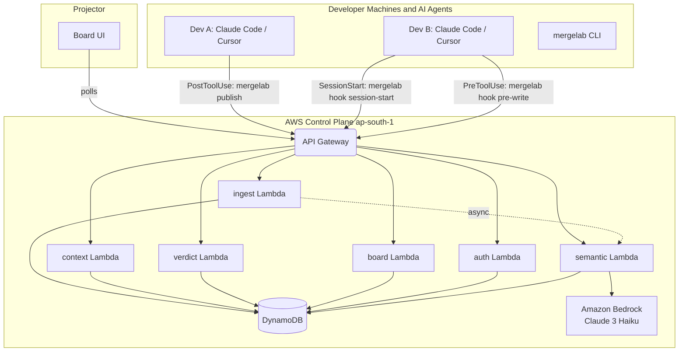

# Merge Lab

**The pre-push interface contract registry for developers and AI agents.**

[](https://main.dm8i0zl4w1m4z.amplifyapp.com/)
[](https://youtu.be/27SFZ19AJ5s?si=4X6rblSmGCwq4Gzw)

- **Live Application:** [https://main.dm8i0zl4w1m4z.amplifyapp.com/](https://main.dm8i0zl4w1m4z.amplifyapp.com/)
- **Demo Video:** [https://youtu.be/27SFZ19AJ5s](https://youtu.be/27SFZ19AJ5s?si=4X6rblSmGCwq4Gzw)

Your teammate picks `axios` and names a field `user_id` in the first five minutes of work. Your AI agent, running on a separate branch, drafts `node-fetch` and `userId`. Neither side pushes for hours. By merge time, everything breaks.

Merge Lab kills that problem at the root. A local CLI reads each dev's working tree (including uncommitted changes) on demand and publishes **declarations only**: exported signatures, data shapes, deps, env var names, routes. Never source code. Teammates' agents read those contracts at `SessionStart` and get blocked at `PreToolUse` the instant a write drifts from an established decision.

Not a filesystem watcher. Not a background daemon. A command you run, with full visibility and control.

## Architecture

Serverless, running in AWS region `ap-south-1`.



## Layout

| Path | Role |
| --- | --- |
| `packages/shared` | Canonical declaration contract types. Everyone imports from here. |
| `packages/extractor` | ts-morph walk of a working tree into `Declaration[]`. |
| `services/resolver` | Six deterministic drift rules. Pure, no AWS, no LLM. |
| `fixtures` | Source trees and expected declarations for extractor tests. |
| `infra` | SAM: Lambda + API Gateway + DynamoDB + Bedrock (ap-south-1). |
| `services/ingest` | Accepts published declarations from the CLI. |
| `services/context` | Serves teammate contracts at `SessionStart`. |
| `services/verdict` | Deterministic drift check consumed at `PreToolUse`. |
| `services/board` | Serves the projector board snapshot (`GET /v1/board`). |
| `services/auth` | Workspace tokens, join requests, credential hashing. |
| `services/semantic` | Async advisory semantic-duplicate check via Bedrock. |
| `packages/daemon` | The CLI that walks the working tree. Deliberate choice over a background daemon. |
| `packages/hooks` | `SessionStart` + `PreToolUse` hooks. Fail open. |
| `board` | Dashboard UI (React + Vite). |

## Stack

Node 20, TypeScript, ESM, ts-morph, vitest, pnpm workspaces.
AWS: Lambda + API Gateway + DynamoDB + Bedrock via SAM. Region `ap-south-1`.

## Hard Rules

- **Never transmit source code.** Only exported symbols, signatures, shapes, dependencies, env var names, and routes. Never file contents, diffs, or literal values.
- **Deterministic enforcement.** Writes are blocked only by the 6 deterministic resolver rules. Never on an LLM opinion. The 300ms budget is non-negotiable.
- **Fail-open by design.** On any error, network timeout, missing config, or blown budget, hooks print nothing and exit `0`.
- **Factual context.** Injected agent context contains only factual declarations about active contracts and repo conventions. Never imperative instructions.
- **Async advisory AI.** Amazon Bedrock runs purely asynchronously off the ingest path to flag fuzzy duplicate symbols (`SEMANTIC_DUPLICATE`). It is never in the blocking verdict path and its severity is strictly `warn`.

## Quickstart

### 1. Requirements
- Node.js 20+
- pnpm 9+

### 2. One-Command Setup
Install dependencies, run typechecks across all workspace packages, and execute the test suite:
```bash
pnpm install && pnpm typecheck && pnpm test
```

### 3. Run the Board Locally
Start the React projector dashboard in demo mode:
```bash
pnpm --filter @mergelab/board dev
```
Open `http://localhost:5173/` in your browser.

### 4. Run the Deterministic Scenarios Table
Merge Lab verifies its 6 deterministic rules (`DEP_CONFLICT`, `NAMING_DRIFT`, `DUP_SYMBOL`, `ROUTE_COLLISION`, `SHAPE_MISMATCH`, `STALE_BINDING`) using an isolated scenarios runner:
```bash
pnpm --filter @mergelab/resolver run test:scenarios
```

## Connecting an IDE

Developers configure the `mergelab` binary in their IDE hooks. First initialize your local config:
```bash
mergelab init --api-url https://<api-id>.execute-api.ap-south-1.amazonaws.com --token <workspace-token> --mode block
```
Modes: `block` to deny drifting writes, `warn` to allow with context, or `off` to disable.

### Claude Code Configuration
Add Merge Lab hooks to your project's `.claude/settings.json`:
```json
{
  "hooks": {
    "SessionStart": [
      {
        "hooks": [
          { "type": "command", "command": "mergelab hook session-start" }
        ]
      }
    ],
    "PreToolUse": [
      {
        "matcher": "Edit|Write|MultiEdit",
        "hooks": [
          { "type": "command", "command": "mergelab hook pre-write" }
        ]
      }
    ],
    "PostToolUse": [
      {
        "matcher": "Edit|Write|MultiEdit",
        "hooks": [
          { "type": "command", "command": "mergelab publish" }
        ]
      }
    ]
  }
}
```

### Cursor Configuration
Add Merge Lab hooks to your project's `.cursor/hooks.json`:
```json
{
  "version": 1,
  "hooks": {
    "sessionStart": [{ "command": "mergelab hook session-start" }],
    "preToolUse": [{ "command": "mergelab hook pre-write" }],
    "afterFileEdit": [{ "command": "mergelab publish" }]
  }
}
```

## Running Tests

Run the full test suite:
```bash
pnpm test
```
Or run Vitest directly with threaded pool execution:
```bash
npx vitest run --pool=threads
```

## Known Seams

Transparency on what is deliberately not built or remains manual:

- **Cognito and IAM Federation**: Authentication uses hashed workspace tokens (`ml_ws_...`) and the legacy static bearer token (`MERGELAB_TOKEN`). No AWS Cognito User Pool or IAM federated identity provider.
- **EventBridge and Real-time WebSockets**: No Amazon EventBridge event bus or WebSocket API Gateway. The Board UI polls `/v1/board` (every 3 seconds), and hooks query HTTP endpoints on demand.
- **GSI2 (Reverse Symbol Index)**: DynamoDB provisions `GSI1` (branch-level partition queries). A second index (`GSI2`) for reverse lookups (symbol to all consumer branches) is not modeled.
- **Persisted Coupling Graph**: `runRules` compares incoming declarations against active contracts loaded for the repo. No durable graph database or persisted dependency edge store.
- **BIND Row Ingestion**: The `verdict` handler contains logic to evaluate `STALE_BINDING` by reading `BIND#<branch>#<contract_id>` items, but no public API endpoint currently writes `BIND` records. In practice, `STALE_BINDING` stays silent unless rows are manually seeded.
- **Automated Branch Lifecycle**: Only `declared` and `changed` contract statuses are produced by the ingest handler. Lifecycle transitions (`implementing`, `implemented`, `abandoned`) are not automatically synchronized with git remote deletions.
- **Shared HTTP Library**: Authentication, logging, and DynamoDB marshalling helpers are kept local to each Lambda package to preserve team ownership boundaries, rather than extracted into a shared package.
